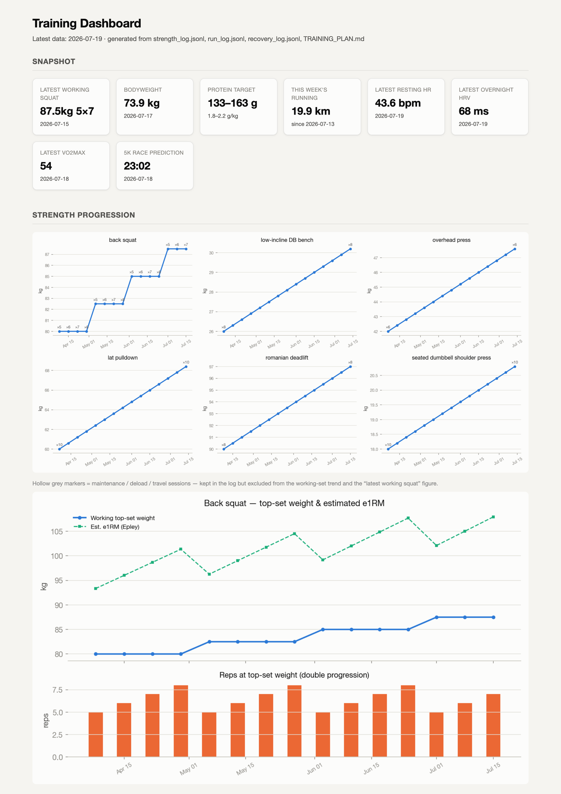

# Claude Training Companion

Turn [Claude Code](https://claude.com/claude-code) into a personal endurance and strength coach. It pulls your own training data, keeps a durable log of every session, and checks each one against your plan. You talk to it in ordinary sentences; it does the recording and the analysis.

It connects to Strava (runs and rides) and Garmin Connect (sleep, HR, HRV, stress, body battery, VO2max, race predictions, and per-run running power and dynamics), stores everything in a local SQLite database, and keeps append-only, git-committed logs of every strength session, run, recovery night, sleep curve, cross-training session and weigh-in. The database is a cache you can rebuild; the logs are the record that survives. A bundled Claude Code skill runs the same procedure every time you ask, so a session never goes unlogged.

> ⚠️ **Not medical advice.** This is a personal-analytics and coaching-assistant template. It does not diagnose or treat anything. Talk to a doctor before changing training, and never act on health numbers without professional input.



*The self-contained `dashboard.html`, rendered here from example data: snapshot cards, per-lift progression (including the double-progression rep climb), weekly running volume and polarisation, plus recovery and fitness trends. It builds from your committed logs and opens in any browser with no server.*

---

## What it does

- **Morning recovery check:** pull last night's Garmin HR, stress and body-battery and get a green / amber / red call for the day's training.
- **Strength logging:** tell Claude "I did 5×5 squat at 100 kg" and it appends a structured entry to an append-only JSONL (the single source of truth), rebuilds a per-exercise progression view, and commits to git.
- **Run analysis:** pull a run from Strava, compute HR time-in-zone and cardiac drift against a polarisation target, and append it to a durable run log.
- **Durable logs for everything else:** recovery (sleep score, stages, resting HR, derived overnight HR floor, HRV, body battery, VO2max, race predictions), the nightly sleep-stage curve, cross-training cardio (elliptical/bike/swim, with HR zones and drift), and bodyweight each get their own committed JSONL, rebuilt from the database so nothing lives only in the cache.
- **Running power and dynamics:** on watches that record them (Forerunner 255+/265 generation), each run also carries running power, cadence, ground-contact time and vertical oscillation, none of which Strava keeps.
- **Offline dashboard:** `build_dashboard.py` renders the `dashboard.html` shown above (strength progression, running volume and polarisation, recovery and fitness trends, bodyweight). It opens in any browser with no server.
- **Training planning:** keep a living `TRAINING_PLAN.md` and have Claude cross-check each session against it.
- **Data-quality caveats:** `CLAUDE.md` documents the device quirks that give wrong numbers if you ignore them. Treadmill speed from the wrist is unreliable, ergometer watts are not running power, Garmin's resting-HR scalar overstates recovery, and VO2max and race predictions are sparse by design.

## Talking to it

You tell it what you did, several exercises at once if you like, and it records the lot:

```
you    ▸ lower day done. back squat 5×5 at 100kg, last set a grinder.
         RDL 3×8 at 90, leg press 3×12 at 180, then calf raises 4×15.
claude ▸ ✓ Logged to strength_log.jsonl
         Saved back squat 100kg 5×5, romanian deadlift 90kg 3×8, leg
         press 180kg 3×12, calf raise 4×15. Squat is up from 97.5kg last
         week; that last set at about RPE 9 says hold 100kg until all
         five clear at RPE 8 or below. Rebuilt the progression view and
         committed.
```

It canonicalises the names ("RDL" becomes "romanian deadlift"), expands "5×5" into five sets, and keeps the whole session on one line. Runs work the same way ("pull my run"), as do recovery ("how did I sleep?") and reviews ("weekly review"). The skill runs the full logging procedure each time, so nothing gets dropped.

## How it works

```
Strava  ─┐
         ├─► scripts/sync.py ─► data/fitness.db (SQLite, gitignored)
Garmin  ─┘                              │
                                        ├─► build_actuals_sheet.py  ─► strength progression view
strength_log.jsonl (committed) ─────────┤
                                        ├─► build_run_log.py        ─► run_log.jsonl        (committed) + CSV
                                        ├─► build_recovery_log.py   ─► recovery_log.jsonl   (committed)
                                        ├─► build_sleep_curves.py   ─► sleep_curves.jsonl   (committed)
                                        ├─► build_cardio_log.py     ─► cardio_log.jsonl     (committed)
                                        ├─► build_weight_log.py     ─► weight_log.jsonl     (committed)
                                        └─► build_dashboard.py      ─► dashboard.html        (offline)
```

The JSONL files are the source of truth, committed to git. The SQLite database and any spreadsheets are derived views you can regenerate at any time.

## Setup

1. **Clone and install**
   ```bash
   git clone https://github.com/jonstraveladventures/claude-training-companion.git
   cd claude-training-companion
   python -m venv .venv && source .venv/bin/activate
   pip install -r requirements.txt
   ```

2. **Add your API credentials:** copy `.env.example` to `.env` and fill in:
   - **Strava:** create an app at <https://www.strava.com/settings/api> to get a client ID/secret, then run `python scripts/strava_auth.py` to obtain a refresh token.
   - **Garmin:** your normal Garmin Connect email and password (Garmin has no official API; this uses the community [`garminconnect`](https://github.com/cyberjunky/python-garminconnect) library).

   `.env` is gitignored, so your credentials never leave your machine.

3. **Initialise the database and run a first sync**
   ```bash
   python scripts/init_db.py
   python scripts/sync.py
   ```

4. **Set your personal numbers** (placeholders ship in the repo):
   - HR zones in `src/fitness/zones.py` (`PERSONAL_ZONE_UPPERS`), the single source of truth shared by the run and cardio logs. Set them from your own max/resting HR (Karvonen/HRR).
   - Your timezone via the `TZ_NAME` env var (e.g. `export TZ_NAME="Europe/London"`).
   - Edit `CLAUDE.md`, `.claude/skills/training-companion/SKILL.md`, and `TRAINING_PLAN.md` to your goals, constraints, and recovery baselines.

5. **Open the folder in Claude Code** and talk to it: "how was my sleep last night?", "I just did 5×5 squats at 100 kg", "pull my run", "weekly review". The skill triggers automatically.

## Privacy & safety notes

- All data stays local (SQLite, JSONL, and your `.env`). Nothing is uploaded anywhere except the API calls to your own Strava and Garmin accounts.
- `data/` (the database, CSVs, images) and `.env` are gitignored by default. Only the JSONL logs are committed, so review them before pushing to any public remote.
- The Garmin integration uses your account password (no official API exists). Treat your `.env` accordingly and never commit it.
- Built to pair with Claude Code's safety model: it asks before irreversible actions and never enters financial or credential data.

## Layout

| Path | What |
|---|---|
| `src/fitness/` | Strava + Garmin sync, DB schema, HR-zone computation |
| `scripts/` | CLI entry points: sync, strength/run/recovery/sleep/cardio/weight log builders, the dashboard, and plots |
| `.claude/skills/training-companion/SKILL.md` | The Claude Code skill (routines: recovery / log / run / weekly review / cross-training) |
| `CLAUDE.md` | Project conventions, logging protocol, and the data-quality caveats Claude follows |
| `TRAINING_PLAN.md` | Your living plan (example provided) |
| `data/` | Local DB + derived views (gitignored) + committed JSONL logs |
| `docs/` | README assets (the dashboard screenshot) |

## Credits

Built with [Claude Code](https://claude.com/claude-code). Uses [stravalib](https://github.com/stravalib/stravalib) and [python-garminconnect](https://github.com/cyberjunky/python-garminconnect). MIT licensed; see `LICENSE`.
