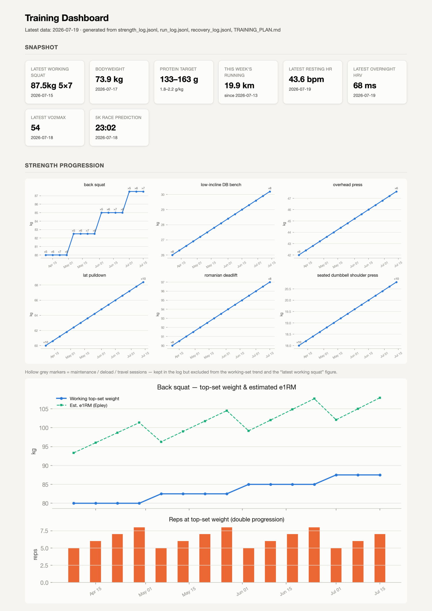

# Claude Training Companion

Turn [Claude Code](https://claude.com/claude-code) into a personal endurance and strength coach. It pulls your training data, keeps a durable log of every session, and checks each session against your plan. You talk to it in ordinary sentences, and it records and analyses the data.

It connects to Strava for runs and rides, the Concept2 Logbook for rows if you use an erg, and Garmin Connect for sleep, HR, HRV, stress, body battery, VO2max, race predictions, scheduled workouts, and per-run running power and dynamics. It stores the data in a local SQLite database and keeps append-only JSONL logs of every strength session, run, recovery night, sleep curve, overnight HRV trace, cross-training session, row and weigh-in. The database is a rebuildable cache; the JSONL logs are the durable record. Every builder that reads the database merges its output with the log already on disk, so rebuilding the database does not blank a log. A bundled Claude Code skill runs the same logging and analysis procedure each time you ask.

> ⚠️ **Not medical advice.** This is a personal-analytics and coaching-assistant template. It does not diagnose or treat anything. Talk to a doctor before changing training, and never act on health numbers without professional input.



*The self-contained `dashboard.html`, rendered here from example data: snapshot cards, per-lift progression (including the double-progression rep climb), weekly running volume and polarisation, plus recovery and fitness trends. It builds from your JSONL logs and opens in any browser with no server.*

---

## What it does

- **Morning recovery check:** sync last night's sleep score and stages, overnight HR floor and resting HR, HRV with Garmin's HRV Status band, overnight respiration, body battery, stress and training readiness, then get a green / amber / red call for the day's training.
- **Strength logging:** tell Claude "I did 5×5 squat at 100 kg" and it appends a structured entry to an append-only JSONL, the single source of truth, and rebuilds a per-exercise progression view.
- **Run analysis:** pull a run from Strava, check it against the workout scheduled in Garmin Connect for that day, compute HR time-in-zone and cardiac drift against a polarisation target, and add the run to a durable log. Time in zone and drift are weighted by time because Strava downsamples its streams.
- **Durable logs for everything else:** recovery (sleep score, stages, resting HR, derived overnight HR floor, HRV and HRV Status, respiration, body battery, VO2max, race predictions), the nightly sleep-stage curve, the overnight HRV trace, cross-training cardio (elliptical/bike/swim, with HR zones and drift), Concept2 rowing and bodyweight each have their own JSONL log. Every builder that reads the database merges its output with the copy on disk, so the database is never the only copy.
- **Running power and dynamics:** on watches that record them (Forerunner 255+/265 generation), each run also includes running power, cadence, ground-contact time and vertical oscillation, none of which Strava keeps.
- **Offline dashboard:** `build_dashboard.py` renders the `dashboard.html` shown above, with strength progression, running volume and polarisation, recovery and fitness trends, and bodyweight. It opens in any browser with no server.
- **Training planning:** keep a living `TRAINING_PLAN.md` and have Claude check each session against it.
- **Data-quality caveats:** `CLAUDE.md` documents device quirks that can give you the wrong numbers if you ignore them. Treadmill speed from the wrist is unreliable, ergometer watts are not running power, Garmin's resting HR reads high after a late meal, a drink or a late night (so the derived overnight HR floor is the better recovery marker), and VO2max and race predictions are sparse by design.
- **Papers that shaped it:** [`REFERENCES.md`](REFERENCES.md) lists, with DOIs, the studies behind the methods the code computes (Karvonen zones, Epley e1RM, Seiler's polarised distribution) and the wider training choices.

## Talking to it

Tell it what you did, including several exercises at once, and it records the session:

```
you    ▸ lower day done. back squat 5×5 at 100kg, last set a grinder.
         RDL 3×8 at 90, leg press 3×12 at 180, then calf raises 4×15.
claude ▸ ✓ Logged to strength_log.jsonl
         Saved back squat 100kg 5×5, romanian deadlift 90kg 3×8, leg
         press 180kg 3×12, calf raise 4×15. Squat is up from 97.5kg last
         week; that last set at about RPE 9 says hold 100kg until all
         five clear at RPE 8 or below. Rebuilt the progression view.
```

It canonicalises names ("RDL" becomes "romanian deadlift"), expands "5×5" into five sets, and keeps the whole session on one line. Runs work the same way ("pull my run"), as do recovery ("how did I sleep?") and reviews ("weekly review"). The skill runs the full logging procedure each time.

## How it works

```
Strava  ─┐
         ├─► scripts/sync.py ─► data/fitness.db (SQLite cache)
Garmin  ─┘                              │
                                        ├─► build_actuals_sheet.py  ─► strength progression view
strength_log.jsonl ─────────────────────┤
                                        ├─► build_run_log.py        ─► run_log.jsonl + CSV
                                        ├─► build_recovery_log.py   ─► recovery_log.jsonl
                                        ├─► build_sleep_curves.py   ─► sleep_curves.jsonl
                                        ├─► build_hrv_trace.py      ─► hrv_trace.jsonl
                                        ├─► build_cardio_log.py     ─► cardio_log.jsonl
                                        ├─► build_weight_log.py     ─► weight_log.jsonl
                                        └─► build_dashboard.py      ─► dashboard.html (offline)
Concept2 API cache (from sync.py) / CSV exports /
pm5-force-logger sessions ─► build_rowing_log.py ─► rowing_log.jsonl
```

The JSONL files are the source of truth. Every builder that reads the database merges its output with the file already on disk instead of overwriting it, so values that are no longer in the database survive a rebuild. The SQLite database and any spreadsheets are derived views that you can regenerate at any time.

## Setup

1. **Clone and install**
   ```bash
   git clone https://github.com/jonstraveladventures/claude-training-companion.git
   cd claude-training-companion
   python -m venv .venv && source .venv/bin/activate
   pip install -r requirements.txt
   ```

2. **Add your API credentials:** copy `.env.example` to `.env` and fill in:
   - **Strava:** create an app at <https://www.strava.com/settings/api> to get a client ID/secret, then run `python scripts/strava_auth.py` to obtain a refresh token.
   - **Garmin:** use your normal Garmin Connect email and password (Garmin has no official API; this uses the community [`garminconnect`](https://github.com/cyberjunky/python-garminconnect) library).
   - **Concept2 (optional, if you row):** register an API application with Concept2 (see the [Logbook API documentation](https://log.concept2.com/developers/documentation/)) with the redirect URI `http://localhost:8766`, add its client ID and secret, then run `python scripts/concept2_auth.py`. Access is read-only. Leave these blank and `sync.py` skips Concept2.

   `.env` is gitignored. Strava may issue a new refresh token when the old one is used, and Concept2 issues one every time. The sync writes the new token back to `.env` atomically, with file mode 600, so token rotation cannot lock you out.

3. **Initialise the database and run a first sync**
   ```bash
   python scripts/init_db.py
   python scripts/sync.py
   ```

4. **Set your personal numbers:**
   - Set your HR zones in `src/fitness/zones.py` (`PERSONAL_ZONE_UPPERS`), the single source of truth shared by the run and cardio logs. The repo ships example values set by hand near Karvonen bands for a maximum HR of 195 and a resting HR of 42. Replace them with zones from your own max and resting HR, or from a lab test.
   - Set your timezone and units in the Defaults section of `CLAUDE.md`, which Claude uses for timestamps. The overnight-HR plot (`scripts/plot_overnight.py`) reads the `TZ_NAME` env var (e.g. `export TZ_NAME="Europe/London"`).
   - Edit `CLAUDE.md`, `.claude/skills/training-companion/SKILL.md`, and `TRAINING_PLAN.md` for your goals, constraints, and recovery baselines.

5. **Open the folder in Claude Code** and talk to it: "how was my sleep last night?", "I just did 5×5 squats at 100 kg", "pull my run", "weekly review". The skill triggers automatically.

## Privacy & safety notes

- All data stays local (SQLite, JSONL, and your `.env`). Nothing is uploaded anywhere except through API calls to your own Strava, Garmin and Concept2 accounts.
- Training and health data stays out of git: `.gitignore` ignores `data` outright, along with `.env`. The logs live only on your machine, because git history is permanent and hard to scrub, and a repository can be made public by accident. Back the logs up as you would any other files, or make `data/` a symlink to a folder your sync client already covers (Dropbox, iCloud Drive or Syncthing). Every code path goes through `ROOT / "data"`, so nothing else needs to change. Tell the sync client to skip the SQLite file (`xattr -w com.dropbox.ignored 1 data/fitness.db` for Dropbox), so it does not copy a live database mid-write. The database is a rebuildable cache.
- The Garmin integration uses your account password (no official API exists). Treat your `.env` accordingly and never commit it.

## Layout

| Path | What |
|---|---|
| `src/fitness/` | Strava, Garmin and Concept2 sync, DB schema, HR-zone computation, and the merge that keeps the logs durable |
| `scripts/` | CLI entry points: sync, strength/run/recovery/sleep/cardio/weight/rowing log builders, the dashboard, and plots |
| `.claude/skills/training-companion/SKILL.md` | The Claude Code skill (routines: recovery / log / run / weekly review / cross-training) |
| `CLAUDE.md` | Project conventions, logging protocol, and the data-quality caveats Claude follows |
| `TRAINING_PLAN.md` | Your living plan (example provided) |
| `REFERENCES.md` | Verified sports-science citations behind the methods and training choices |
| `examples/` | An example strength log (the smoke test builds from it) |
| `tests/` | Unit tests that run without network access or credentials (`python -m unittest discover -s tests`) |
| `data/` | Your local DB and JSONL logs (gitignored; created by `init_db.py`) |
| `docs/` | README assets (the dashboard screenshot) |

## Related projects

[pm5-force-logger](https://github.com/jonstraveladventures/pm5-force-logger) records a Concept2 PM5's per-stroke force curves from a web page in Chrome or Edge, on a computer or on Chrome for Android, with nothing to install. A Python version for the Mac also uploads rows to the Concept2 Logbook. It grew out of this project and uses the same pattern of a JSONL record and a rebuildable cache. If you row, `build_rowing_log.py` turns your Logbook results (from the API sync or CSV exports) into `data/rowing_log.jsonl`, filling in heart rate and splits for rows that pm5-force-logger posted. The dashboard then adds rowing to the cross-training chart.

## Credits

Built with [Claude Code](https://claude.com/claude-code). Uses [stravalib](https://github.com/stravalib/stravalib) and [python-garminconnect](https://github.com/cyberjunky/python-garminconnect). MIT licensed; see `LICENSE`.
